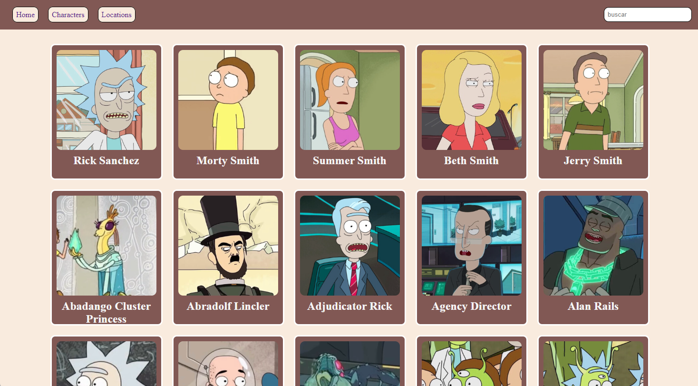

# Rick-Morty 

  

  
"Made with the Rick & Morty API"

  <a href="https://teojimenez.github.io/Rick-Morty.github.io/" target="_blank">Explore the website</a>
  

  

## Features
- Cards of the characters of the series, and cards of the different planets with photos of the residents.
- Cards with the information of the characters: Specie, Type, Gender, Origin and Location.
- Search bar for the characters and the locations
- A breakpoint in the pixel measurement of a telephone, which inverts the color palette.
## Media
- [Page-Character](img/main-character.png)
- [Page-Location](img/main-location.png)
### More information
Credits:
- [API](https://teojimenez.github.io/Rick-Morty.github.io/)

