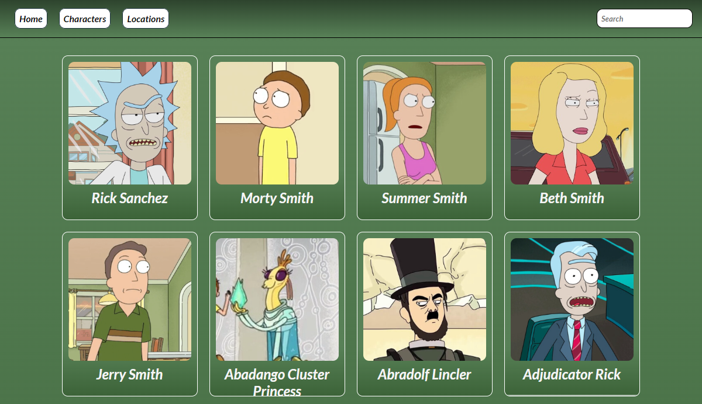

# Rick-Morty
Web made with the Rick & Morty API.
## Media
# Mi Proyecto

    

        
        
    

    

## Features
- Cards of the characters of the series, and cards of the different planets with photos of the residents.
- Cards with the information of the characters: Specie, Type, Gender, Origin and Location.
- Search bar for the characters and the locations
- A breakpoint in the pixel measurement of a telephone, which inverts the color palette.
### More information
Credits:
- [API](https://teojimenez.github.io/Rick-Morty.github.io/)
- 
